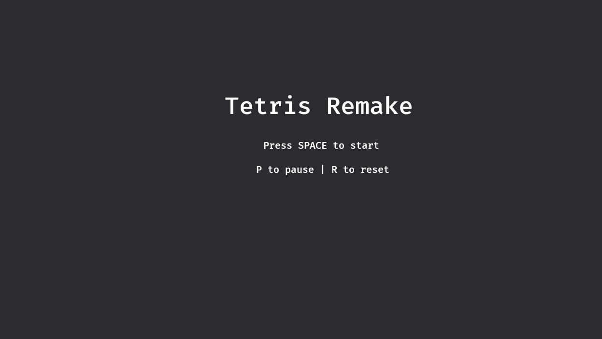

# Bevy Tetris

A simple project of recreating Tetris in Rust using Bevy.

## Screenshots

*Screenshots coming soon! Feel free to add gameplay images here.*

*Title screen with game instructions*

*Active gameplay showing falling tetrominos*

*Game over screen with final score*

## How to Run

In order to run after cloning, simply type `cargo run` from the command line or terminal in the project root.

## Features

- Classic Tetris gameplay with all 7 tetromino shapes
- Score tracking and level progression
- Next piece preview
- Pause functionality
- Game over detection
- Background music
- Clean, modular code architecture

## Controls

- **Arrow Keys**: Move and rotate pieces
  - ⬅️ Left Arrow: Move left
  - ➡️ Right Arrow: Move right
  - ⬇️ Down Arrow: Soft drop
  - ⬆️ Up Arrow: Rotate piece
- **Space**: Hard drop (instant drop to bottom)
- **P**: Pause/Resume game
- **R**: Reset game (restart from title screen)
